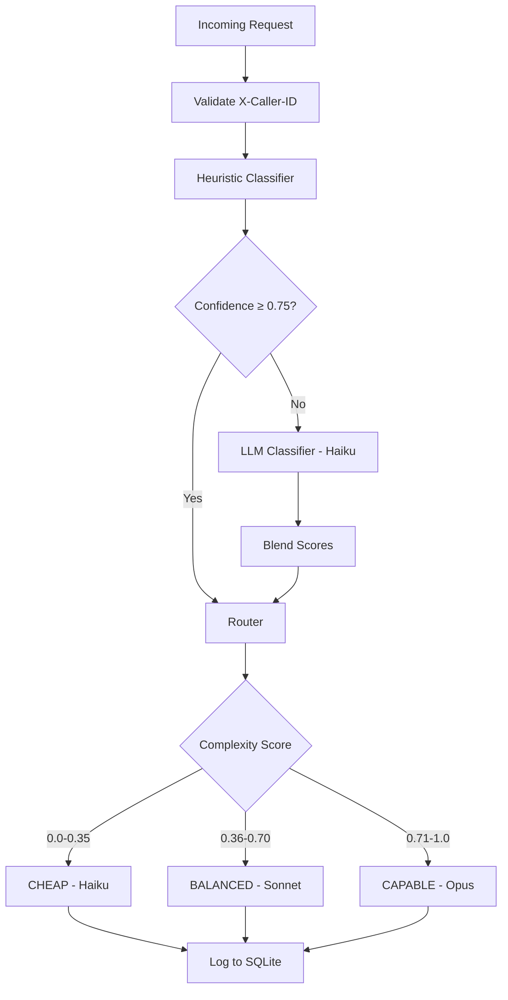

# LLM Cost Guard

A FastAPI proxy gateway that sits between your application and LLM providers, automatically routing requests to the most cost-effective model without sacrificing quality.

## The Problem

Most applications send every request to the same expensive model — regardless of complexity. A simple "What is the capital of France?" costs the same as "Design a distributed rate-limiting system." That is wasteful.

## The Solution

LLM Cost Guard classifies every request by complexity and routes it to the appropriate model tier:
At 10,000 requests/day with 70% simple, 20% moderate, 10% complex:
- **Without routing:** $250/day (all Opus)
- **With routing:**     $42/day
- **Saving:**          $208/day → $75,000/year

## How It Works



### Three-tier routing

| Score     | Tier     | Model   | Cost/M tokens |
|-----------|----------|---------|---------------|
| 0.0–0.35  | CHEAP    | Haiku   | $5.00         |
| 0.36–0.70 | BALANCED | Sonnet  | $15.00        |
| 0.71–1.0  | CAPABLE  | Opus    | $25.00        |

### Classifier signals

The heuristic classifier scores prompts using weighted pattern matching:

| Signal              | Weight | Example                          |
|---------------------|--------|----------------------------------|
| System design       | +0.28  | "Design a distributed system"    |
| Mathematical proof  | +0.20  | "Prove that sqrt(2) is irrational"|
| Step by step        | +0.15  | "Explain step by step"           |
| Simple lookup       | -0.20  | "What is X"                      |
| Greeting            | -0.25  | "Hi", "Thanks"                   |

When heuristic confidence is below 0.75, a meta-LLM call to Haiku provides a second opinion. Results are SHA-256 cached — identical prompts never hit the classifier API twice.

## Features

- **Zero code changes** — drop-in replacement for the Anthropic API endpoint
- **X-Caller-ID header** — mandatory caller identification for per-service tracking
- **X-Model-Tier header** — callers can override routing when needed
- **Per-caller cost policies** — cap individual services at a maximum tier
- **Live dashboard** — real-time cost and savings visibility
- **Full audit trail** — every routing decision logged with signals and scores

## Quick Start

### 1. Clone and install

```bash
git clone https://github.com/vinodlp/llm-cost-guard
cd llm-cost-guard
python -m venv venv
venv\Scripts\activate       # Windows
pip install -r requirements.txt
```

### 2. Configure

```bash
cp .env.example .env
# Add your ANTHROPIC_API_KEY to .env
```

### 3. Run

```bash
python -m uvicorn proxy.main:app --reload
```

### 4. Send a request

```bash
curl -X POST http://localhost:8000/v1/messages \
  -H "Content-Type: application/json" \
  -H "x-caller-id: my-service" \
  -H "anthropic-version: 2023-06-01" \
  -d '{
    "model": "claude-opus-4-6",
    "max_tokens": 100,
    "messages": [{"role": "user", "content": "What is the capital of France?"}]
  }'
```

The request is automatically routed to Haiku — you pay for Haiku, not Opus.

### 5. View dashboard

Open your browser at `http://localhost:8000/dashboard`

## API Endpoints

| Endpoint | Method | Description |
|----------|--------|-------------|
| `/v1/messages` | POST | Proxy endpoint — drop-in Anthropic replacement |
| `/dashboard` | GET | Live cost and routing dashboard |
| `/stats` | GET | JSON stats for programmatic access |
| `/health` | GET | Health check |

## Configuration

Edit `config/pricing.yaml` to update model pricing or tier assignments:

```yaml
tiers:
  cheap:
    anthropic: claude-haiku-4-5-20251001
  balanced:
    anthropic: claude-sonnet-4-6
  capable:
    anthropic: claude-opus-4-6
```

No code changes needed — just edit the config and restart.

## Project Structure

\```
llm-cost-guard/
├── classifier/
│   ├── models.py          # Data structures
│   ├── heuristic.py       # Pattern-based classifier
│   ├── llm_classifier.py  # Meta-LLM fallback
│   └── ensemble.py        # Orchestrates both
├── router/
│   └── router.py          # Tier selection and model routing
├── proxy/
│   ├── main.py            # FastAPI app
│   └── logger.py          # SQLite logging
├── dashboard/
│   └── routes.py          # Live dashboard
└── config/
    └── pricing.yaml       # Model pricing and tier config
\```

## Tech Stack

- **FastAPI** — async proxy server
- **tiktoken** — accurate token counting
- **httpx** — async HTTP client
- **SQLite** — request logging
- **Python 3.14**

## Roadmap

- [ ] OpenAI provider support
- [ ] Redis cache for LLM classifier
- [ ] Streaming response support
- [ ] Per-caller budget alerts
- [ ] ML-based classifier trained on logged data